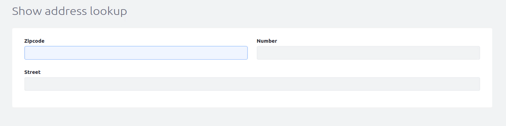
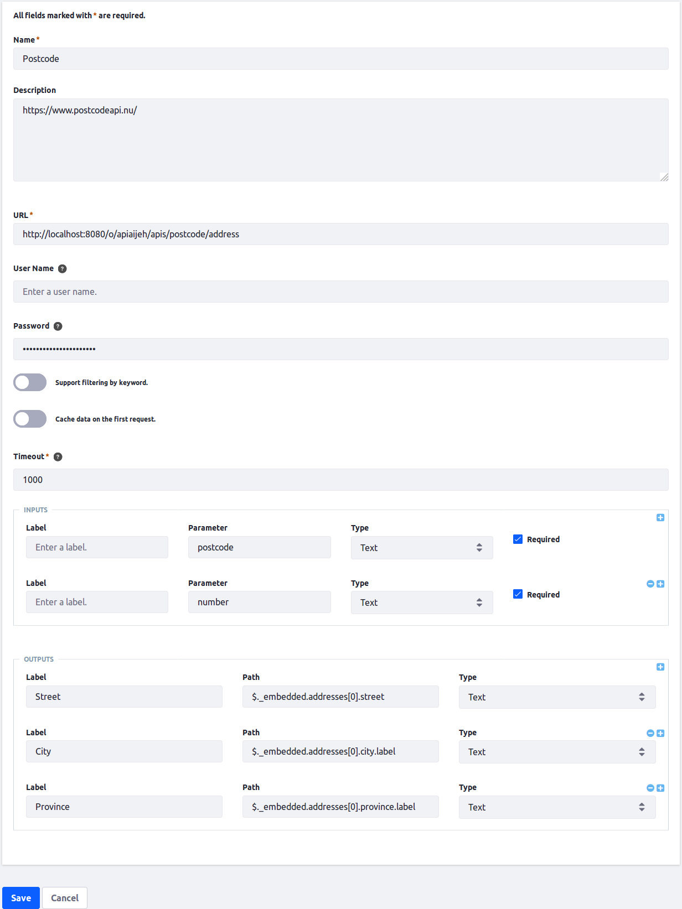

# Example wrapper api to fetch zipcode from external service

[Root Endpoint](https://liferay71.ddns.net/o/apiaijeh/apis)  
[Test Endpoint](https://liferay71.ddns.net/o/apiaijeh/apis/postcode/test)  
[Dynamic Endpoint](https://liferay71.ddns.net/o/apiaijeh/apis/postcode/address?postcode=2315SC&number=6)  

  
  

